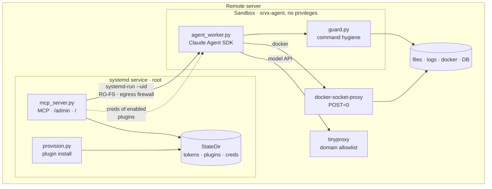

# srv-explore

**Интерфейс, позволяющий агенту безопасно работать и собирать информацию на сервере.
Рядом с данными, логами и сервисами.**

Explore-агент живёт на удалённом сервере за MCP-интерфейсом: подключаешься к нему
нативно по MCP из локального кодового агента и работаешь как со скиллом. Безопасность
помимо промпта обеспечивает окружение — read-only песочница — и система плагинов для
контролируемого доступа к системам (docker, web) и данным (БД, кеши, файлы).


Сервис слушает только loopback: и инженер, и админ ходят через SSH-туннель, публичного
порта нет. Ставится и обновляется деплой-воркфлоу, от остального проекта не зависит.
Схема выше — файл `src/srv_explore/web/flow.svg`, он же отдаётся на странице агента,
так что доки и UI не расходятся.

---

## На что это похоже в работе

```
srv_explore("почему nginx отдаёт 502 последний час?")
  → agent: tail -n 200 /var/log/nginx/error.log | grep 502
            docker logs --since 1h api | tail -50
  → upstream api:8080 connection refused, контейнер api рестартовал 4 раза за час
```

```
srv_explore("сколько заказов в статусе pending старше суток?")
  → agent: psql "$PG_INSPECTOR_DSN" -c "select count(*) from orders where ... limit 1"
  → 1274 (тот же запрос на запись роль бы не пропустила)
```

Запрос — цель словами, не команда. Что агент запускал, видно в истории: и в кабинете
инженера, и в админке.

---

## Зачем это нужно

| Задача | Как решают обычно | Чем кончается | С srv-explore |
|---|---|---|---|
| дать кодовому агенту посмотреть прод | SSH-ключ и `--dangerously-skip-permissions` | одна галлюцинация — `docker compose down`, `DROP TABLE`, `rm -rf` — и прод лежит | деструктивная команда не выполняется, а возвращает отказ: RO-ФС, read-роли БД, Docker API без `POST` |
| разбор инцидента ночью | инженеру выдают SSH «на время» | доступ остаётся навсегда, отзывать его никто не ходит | сервер инженеру не выдаётся вообще; есть токен, который админ отзывает одной кнопкой вместе с ключом |
| нужен один SELECT в проде | пароль рабочей роли уезжает в чужой `.env` | боевые креды разошлись по ноутбукам | плагин создаёт отдельную read-роль, креды остаются на сервере и выдаются агенту по тумблеру |
| собрать контекст по сервису | дежурный копирует логи в чат | ждёшь человека, а секреты из логов остаются в переписке | агент собирает сам, наружу уезжает только ответ на вопрос |
| локальный агент читает удалённые логи | `ssh cat` и скачивание | гигабайты через туннель, данные прода — на рабочей машине | агент работает рядом с данными, по MCP уходит только результат |
| разобраться, кто что делал на сервере | `~/.bash_history`, если повезёт | восстановить действия нельзя | каждый прогон и каждая его команда — в истории сессий |

---

## Быстрый старт

### 1. Поставить — деплой-воркфлоу

Штатный путь — **Actions → «Deploy srv-explore (host service)»**, выбрать environment.
Воркфлоу копирует бандл на сервер и гоняет `install.sh`: юзеры, venv, egress-прокси,
systemd-юнит — идемпотентно. Руками (`sudo bash srv_explore/install.sh`) — только для
отладки.

Требования к серверу: Linux с **systemd и cgroup v2**, root, `python3`, `apt-get`.
В environment нужны `SSH_HOST` / `SSH_USER` (variables) и `SSH_KEY` +
`CLAUDE_CODE_OAUTH_TOKEN` (secrets).

Админ-токен генерится **на сервере** при первой установке и в лог Actions не попадает —
`install.sh` печатает факт, а не значение. Забрать с сервера:

```bash
ssh root@<host> grep SRV_EXPLORE_ADMIN_TOKEN /etc/srv-explore/env
```

Перевыпустить: удалить эту строку и запустить деплой снова.

### 2. Выдать доступ инженеру

Админка на loopback, поэтому через туннель:

```bash
ssh -N -L 8765:localhost:8765 root@<host>     # держать открытым
# → http://localhost:8765/admin, вставить админ-токен
```

**«Пользователи» → Добавить**: метка + публичный SSH-ключ инженера. Вернётся
`srvx_`-токен — отдать инженеру. Удаление пользователя снимает и ключ, и все его токены.

### 3. Инженеру — страница агента

Отдай инженеру токен и ссылку **<http://localhost:8765/>** (открывается по его туннелю).
Там всё, что ему нужно: что это, quick start подключения по MCP, принципы работы, свой
доступ и вопросы к серверу прямо из браузера.

```bash
ssh-keygen -t ed25519 -f ~/.ssh/srvx -N ""            # публичную часть — админу
ssh -N -L 8765:localhost:8765 srvx-tunnel@<host> -i ~/.ssh/srvx
claude mcp add --transport http srv-explore http://localhost:8765/mcp \
  --header "Authorization: Bearer srvx_..."
```

---

## Как устроено



---

## Плагины

Плагин — один файл в `src/srv_explore/plugins/`, который даёт агенту безопасный доступ к
одному ресурсу: `docker`, `postgres`, `redis`, `mongo`, `rabbitmq`. Он ставит клиент,
создаёт отдельный доступ без права записи и обязан это доказать: последний шаг установки
пытается что-нибудь записать и **должен получить отказ**. Всё выключено по умолчанию,
включает администратор.

Как написать свой, что даёт `ctx`, правила работы с секретами — **[PLUGINS.md](PLUGINS.md)**.
