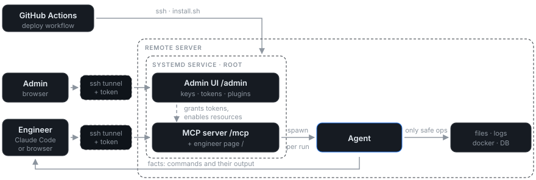
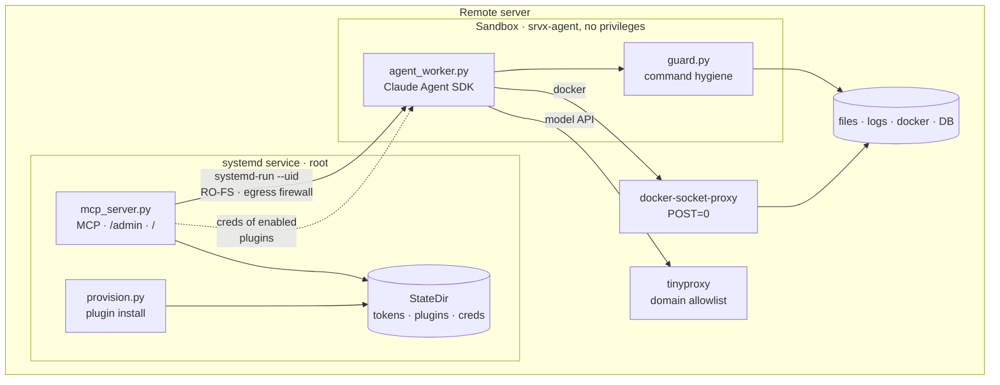

# srv-explore

**Интерфейс, позволяющий агенту безопасно работать и собирать информацию на сервере.
Рядом с данными, логами и сервисами.**

Explore-агент живёт на удалённом сервере за
[MCP](https://modelcontextprotocol.io/specification)-интерфейсом: подключаешься к нему
из локального кодового агента и работаешь как со скиллом. Read-only держит не промпт,
а окружение — песочница без прав записи — и плагины, выдающие контролируемый доступ
к системам (docker, web) и данным (БД, кеши, файлы).



Сервис слушает только loopback: и инженер, и админ ходят через SSH-туннель, публичного
порта нет. Ставится и обновляется деплой-воркфлоу, от остального проекта не зависит.

---

## На что это похоже в работе

```
srv_explore("почему nginx отдаёт 502 последний час?")
  → agent: tail -n 200 /var/log/nginx/error.log | grep 502
            docker logs --since 1h api | tail -50
  → upstream api:8080 connection refused, контейнер api рестартовал 4 раза за час
```

Запрос — цель словами, не команда: чем смотреть, агент решает сам, а в ответе видно,
какие команды он выполнил. Если команда известна заранее, второй инструмент выполняет
её без агента — быстро и без токенов модели:

```
srv_explore_cmd("docker ps --format '{{.Names}} {{.Status}}'")
  → api Up 3 minutes
    db  Up 6 days
```

| Инструмент | Аргумент | Что делает |
|---|---|---|
| `srv_explore` | `task` — цель словами | Прогон агента на сервере. Держит вызов до конца (обычно 20с — пара минут) и возвращает факты + выполненные команды. Больше 8 минут — вернёт `job_id` |
| `srv_explore_cmd` | `cmd` — одна команда | Выполняет её как есть, отдаёт дословный вывод. Без агента: быстро и без токенов модели |
| `srv_explore_status` | `job_id` | Догнать прогон, который не уложился в один вызов |

---

## Зачем это нужно

| Задача | Как решают обычно | С srv-explore |
|---|---|---|
| дать кодовому агенту посмотреть прод | SSH-ключ и `--dangerously-skip-permissions`: одна галлюцинация — и прод лежит | деструктивная команда возвращает отказ: RO-ФС, read-роли БД, Docker API без `POST` |
| разбор инцидента ночью | SSH «на время», который остаётся навсегда | сервер инженеру не выдаётся; токен админ отзывает одной кнопкой вместе с ключом |
| нужен один SELECT в проде | пароль рабочей роли уезжает в чужой `.env` | плагин создаёт отдельную read-роль, креды остаются на сервере |

---

## Быстрый старт

### 1. Поставить — деплой-воркфлоу

**Actions → «Deploy srv-explore (host service)»**, выбрать environment. Воркфлоу
копирует бандл на сервер и гоняет `install.sh` — идемпотентно. Руками
(`sudo bash srv_explore/install.sh`) — только для отладки.

Требования: Linux с **systemd и cgroup v2**, root, `apt-get` (Debian/Ubuntu) —
`python3` доустановится сам. В environment нужны `SSH_HOST` / `SSH_USER` (variables)
и `SSH_KEY` + `CLAUDE_CODE_OAUTH_TOKEN` (secrets).

Админ-токен генерится **на сервере** при первой установке, в лог Actions не попадает:

```bash
ssh root@<host> grep SRV_EXPLORE_ADMIN_TOKEN /etc/srv-explore/env
```

Перевыпустить: удалить эту строку и запустить деплой снова.

### 2. Выдать доступ инженеру

Админка на loopback, поэтому через туннель:

```bash
ssh -N -L 8765:localhost:8765 root@<host>     # держать открытым
# → http://localhost:8765/admin, вставить админ-токен
```

**«Пользователи» → Добавить**: метка + публичный SSH-ключ инженера. Вернётся
`srvx_`-токен — отдать инженеру. Удаление пользователя снимает и ключ, и все его
токены разом.

### 3. Инженеру — страница агента

Отдай инженеру токен и ссылку **<http://localhost:8765/>** (по его туннелю). Там всё
остальное: quick start подключения, принципы работы, свой доступ, вопросы к серверу
из браузера.

```bash
ssh-keygen -t ed25519 -f ~/.ssh/srvx -N ""            # публичную часть — админу
ssh -N -L 8765:localhost:8765 srvx-tunnel@<host> -i ~/.ssh/srvx
claude mcp add --transport http srv-explore http://localhost:8765/mcp \
  --header "Authorization: Bearer srvx_..."
```

---

## Как устроено



---

## Плагины

Плагин — один файл в `src/srv_explore/plugins/`, который даёт агенту безопасный доступ
к одному ресурсу: `docker`, `postgres`, `redis`, `mongo`, `rabbitmq`. Он создаёт
отдельный доступ без права записи и обязан это доказать: последний шаг установки
пытается что-нибудь записать и **должен получить отказ**. Всё выключено по умолчанию,
включает администратор.

Как ими пользоваться и как написать свой — **[PLUGINS.md](PLUGINS.md)**; часть
«написать свой» можно целиком отдать кодовому агенту как задание.
