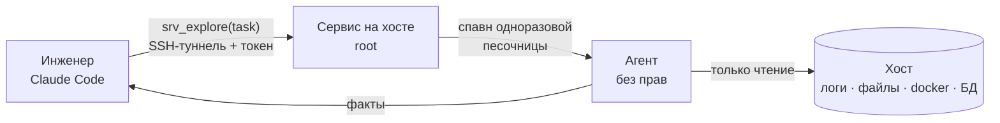
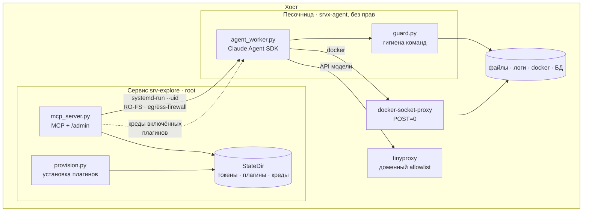
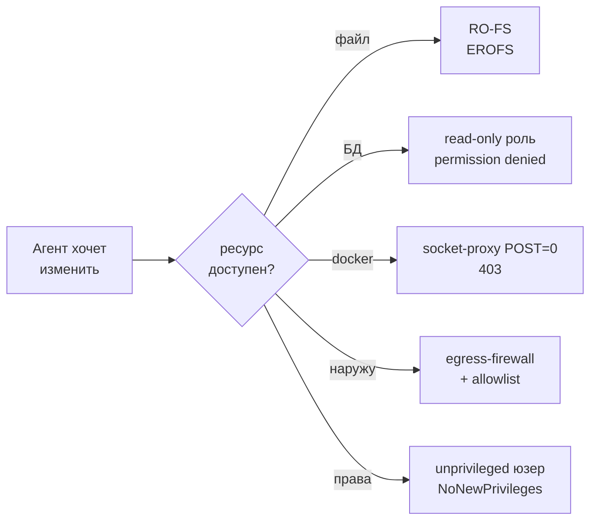
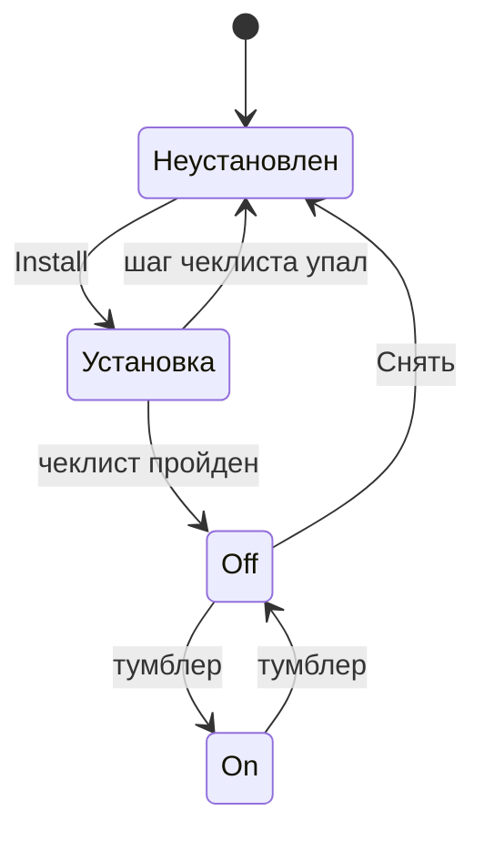

# srv-explore

**Инженер спрашивает сервер словами и получает факты — не имея доступа к серверу.**

На хосте живёт readonly-агент за одним MCP-инструментом. Инженер из своего Claude Code
шлёт задачу («почему сервис отдаёт 502?»), агент читает хост — файлы, логи, код,
контейнеры, БД — и возвращает **сырые факты**: какие команды выполнил и что они показали.
Изменить он ничего не может: это гарантирует не вежливость модели, а недоступность
ресурсов на запись.



Ставится **отдельно**, ни от чего в основном проекте не зависит.

---

## Зачем это нужно

| Без srv-explore | С srv-explore |
|---|---|
| Инженеру дают SSH-доступ к проду «посмотреть» | Доступа к серверу у него нет вообще |
| Или он просит дежурного: «глянь логи», ждёт | Спрашивает сам, ответ за минуту |
| Скопировал команду из чата, ошибся — сломал | Записать физически нечем |
| Что человек делал на сервере — неизвестно | Каждая команда в истории админки |

**Что умеет:** читать любые файлы и логи, доступные unprivileged-юзеру · смотреть
контейнеры (`docker ps/logs/inspect`) · выполнять SELECT-запросы в БД · искать по коду ·
`systemctl status`, `df`, `ps`.

**Чего не умеет и не сможет:** писать в файлы · менять/удалять данные в БД ·
рестартовать сервисы и контейнеры · `sudo` · перезагружать хост · слать данные наружу.

---

## Быстрый старт

Три роли: администратор ставит и выдаёт доступ (1–2), инженер подключается (3–4),
агенту нужен только последний раздел (5).

### 1. Администратор: поставить на сервер

Нужны: Linux с **systemd и cgroup v2**, root, `python3` (venv доставится сам),
`apt-get` для плагинов и прокси. Без cgroup v2 песочница поднимется, но egress
обрубить не выйдет — чип **Network** покажет `open`.

```bash
sudo bash srv_explore/install.sh                      # идемпотентно
echo 'CLAUDE_CODE_OAUTH_TOKEN=...' | sudo tee -a /etc/srv-explore/env
sudo systemctl restart srv-explore
```

Админ-токен (`adm_…`) генерится при первой установке и **никуда не печатается** —
штатный путь установки это деплой-воркфлоу, а его stdout уходит в лог GitHub
Actions. Забрать: `grep SRV_EXPLORE_ADMIN_TOKEN /etc/srv-explore/env`. Перевыпустить:
удалить строку и запустить установку заново.

Открыть админку (сервис слушает только loopback, поэтому через туннель):

```bash
ssh -N -L 8765:localhost:8765 root@<host>     # держать открытым
# → http://localhost:8765/admin, вставить админ-токен
```

### 2. Администратор: выдать доступ инженеру

В админке **«Пользователи» → Добавить**: метка + публичный SSH-ключ инженера.
Вернётся `srvx_`-токен и готовые команды — отдать инженеру. Удаление юзера снимает
и ключ, и все его токены.

Что ещё есть в админке:

| Раздел | Зачем |
|---|---|
| чипы **FileSystem** / **Network** | подтверждение, что песочница действительно заперта; проба снимается один раз при старте сервиса |
| **Плагины** | Install / тумблер / «снять» и чеклист последней установки |
| **Спросить сервер** | тот же агент, что и по MCP, прямо из браузера — удобно проверить установку плагина, не поднимая MCP |
| **История сессий** | последние 100 прогонов с командами; живёт в памяти сервиса и гибнет при рестарте |

### 3. Инженер: подключиться

```bash
ssh-keygen -t ed25519 -f ~/.ssh/srvx -N ""            # публичную часть — админу
ssh -N -L 8765:localhost:8765 srvx-tunnel@<host> -i ~/.ssh/srvx
claude mcp add --transport http srv-explore http://localhost:8765/mcp \
  --header "Authorization: Bearer srvx_..."
```

Чтобы не держать терминал — постоянный туннель через `~/.ssh/config`:

```
Host srvx
  HostName <host>
  User srvx-tunnel
  IdentityFile ~/.ssh/srvx
  LocalForward 8765 localhost:8765
  ExitOnForwardFailure yes
  ServerAliveInterval 30
```

Дальше `ssh -N srvx` (или `autossh -M0 -N srvx` с авто-переподключением).

### 4. Инженер: браузер вместо MCP

По туннелю доступна и страница `http://localhost:8765/` — три вкладки:

| Вкладка | Что там |
|---|---|
| **Что это** | схема и границы: что агент умеет, чего не сможет. Открыта без токена |
| **Мой доступ** | по `srvx_`-токену: своя метка, какие ресурсы сейчас подключены, своя история прогонов с командами |
| **Спросить сервер** | тот же агент, что по MCP: вопрос → шаги → факты |

Токен живёт в `sessionStorage` вкладки браузера, на сервер как cookie не уходит. Чужие
прогоны не видны: `/app/api/*` отдаёт только то, что заведено под меткой этого токена.

### 5. Агент: как пользоваться

Инструмент **асинхронный**: `srv_explore(task)` возвращает `job_id`, результат забирается
поллингом `srv_explore_status(job_id)`.

```
srv_explore("какие контейнеры перезапускались за сутки?")
  → {"job_id": "job_ab12cd", "status": "running",
     "resources": ["Docker — read-only API"]}     # что доступно сверх файлов и логов
srv_explore_status("job_ab12cd")
  → {"status": "running", "steps": [...]}         # шаги видны по ходу
  → {"status": "done", "result": "...", "steps": [...]}
```

Поллить раз в 3–5 секунд; потолок одного прогона — 10 минут. Ответ — **факты**, выводы
делает вызывающий агент. Полный контракт (поля задачи, разбор `error`, границы) — в
скилле `.claude/skills/srv-explore/`, он и есть инструкция для агента.

---

## Как устроено



| Файл | Роль |
|---|---|
| `mcp_server.py` | MCP-инструменты, `/admin`, `/` (кабинет инженера), реестр задач |
| `sandbox.py` | запуск кода агента без прав (`systemd-run`) |
| `agent_worker.py` | сам агент: SDK + hook на каждую Bash-команду |
| `guard.py` | гигиена команд (метасимволы, `/dev/*`) |
| `plugin_api.py` | контракт плагина — см. [PLUGINS.md](PLUGINS.md) |
| `provision.py` | раннер установки плагина, вычистка секретов |
| `profile_store.py` | состояние: On/Off, чеклист, креды |
| `profiles/*.py` | сами плагины |
| `token_store.py`, `tunnel_keys.py` | токены инженеров (на диске только sha256), ключи туннеля |
| `backstop.py` | пробы харденинга (чипы FileSystem / Network) |
| `admin.html`, `ui.html`, `ui.css` | админка, страница инженера, общие стили |
| `install.sh`, `systemd/` | установка на хост |

---

## Модель безопасности

Главный принцип: **read-only держит ресурс-слой, а не разбор команд.** Агенту не
запрещают писать — ему физически нечем.



| Побег | Чем закрыт |
|---|---|
| запись в файлы | `ProtectSystem=strict` — ядро возвращает EROFS |
| запись в БД | read-only роль, созданная плагином; проверена пробой при установке |
| docker-escape | агент вне группы `docker`; ходит в socket-proxy с `POST=0` |
| эксфильтрация | `IPAddressDeny=any` + форвард-прокси с доменным allowlist |
| privesc, reboot | unprivileged `srvx-agent`, `NoNewPrivileges` |
| подвисание | `RuntimeMaxSec` на песочнице (600 с) |

`guard.py` — **не барьер, а гигиена**: режет метасимволы (`>` `;` `&` `$()`) и
`/dev/*`. Смысл — понятный отказ вместо непонятного EROFS, плюс страховка, если
харденинг забыли включить. Всё остальное он пропускает: разбирать команды бесполезно,
способов записи слишком много.

### Дефолт: что доступно, пока плагинов нет

Проверено на живом стенде.

| Операция | Результат |
|---|---|
| чтение файлов и логов, доступных unprivileged-юзеру | ✅ можно |
| запись в `/etc`, `/usr`, `/var`, `/opt` | ⛔ read-only file system |
| чтение root-only (`/etc/shadow`, ключи) | ⛔ permission denied |
| `docker ps` | ⛔ permission denied (нет группы, нет `DOCKER_HOST`) |
| любая БД | ⛔ кред нет |
| `sudo`, `systemctl restart`, reboot | ⛔ нет прав |
| внешний адрес напрямую | ⛔ заблокирован ядром |
| внешний домен не из allowlist | ⛔ 403 от прокси |
| `api.anthropic.com` | ✅ через прокси (агенту нужна модель) |

**Честные оговорки:**
- **`/tmp` пишется** — у песочницы свой `PrivateTmp`, он гибнет вместе с прогоном.
- **Loopback и приватные сети открыты.** Фильтр ядра работает по IP, не по портам, так
  что внутренние сервисы агенту достижимы. Если у такого сервиса нет авторизации — он
  доступен, в том числе на запись через HTTP. Полностью закрывается только сетевым
  namespace для песочницы. Link-local (`169.254.0.0/16`) при этом **закрыт**: там
  живёт cloud metadata и ключи инстанса.
- **Секреты в world-readable файлах** (`.env` с правами 644) агент прочитает — это
  неизбежное свойство «читателя хоста».
- **Инженер с токеном равен агенту по доступу.** Креды включённых плагинов и токен
  модели лежат в окружении агента; гард режет очевидные способы их напечатать
  (`env`, `printenv`, `/proc/*/environ`), но это гигиена, а не барьер — достаточно
  настойчивый запрос их достанет. Поэтому `srvx_`-токен считать таким же секретом,
  как сами эти креды, и отзывать вместе с уходом человека.

---

## Плагины

Плагин даёт агенту доступ к одному типу ресурса. Всё выключено по умолчанию.

**Две кнопки, разный смысл:**

| | что делает |
|---|---|
| **Install** | ставит клиент, создаёт read-only доступ, прогоняет чеклист и **сохраняет креды**. Спрашивает то, что плагин объявил в своей форме (например одноразовый админский DSN — он не сохраняется) |
| **On / Off** | выдавать эти креды агенту или нет. Установку не трогает — можно щёлкать сколько угодно, ничего не переустанавливается. Если одного сокрытия кред мало, плагин закрывает и сам ресурс: `docker` гасит свой прокси, иначе тот остался бы доступен на loopback |
| **Снять** | забывает креды и чеклист, гасит тумблер и зовёт teardown плагина, если тот его умеет. Возврат к нулю, но **созданная в БД роль остаётся** |

Успешный Install **не включает** плагин: тумблер всегда поднимает человек.



Каждая установка заканчивается **пробой-нарушителем**: плагин пытается что-нибудь
записать и обязан получить отказ. Прошло — установка считается неуспешной, креды не
сохраняются.

| Плагин | Даёт агенту | Проба записи |
|---|---|---|
| `docker` | read-only Docker API через socket-proxy | мутирующий вызов → `403` |
| `postgres` | роль `srvx_readonly` (`pg_read_all_data`) | `CREATE TABLE` → `permission denied` |
| `redis` | ACL-юзер `+@read -@dangerous` | `SET` → `NOPERM` |
| `mongo` | юзер с ролью `read` | `insertOne` → `not authorized` |
| `rabbitmq` | monitoring-юзер management API (AMQP-права never-match) | создание очереди → `403` |

**Свой плагин** — отдельный файл в `profiles/`, ядро трогать не нужно:
см. **[PLUGINS.md](PLUGINS.md)**.

Что важно знать про снятие: админский DSN мы намеренно выбрасываем сразу после
установки, поэтому **удалить созданную роль из БД нечем** — «Снять» забывает креды, но
роль остаётся жить в базе. Она read-only и безвредна; если нужно убрать — руками.

---

## Конфиг (`/etc/srv-explore/env`)

| Переменная | Смысл |
|---|---|
| `SRV_EXPLORE_HOST` / `PORT` | bind, по умолчанию `127.0.0.1:8765` |
| `SRV_EXPLORE_ADMIN_TOKEN` | гейт `/admin`, генерит `install.sh` |
| `CLAUDE_CODE_OAUTH_TOKEN` | авторизация модели, пишет деплой (секрет) |
| `SRV_EXPLORE_TRUSTED_DOMAINS` | куда агенту можно наружу через прокси |
| `SRV_EXPLORE_TRUSTED_CIDRS` | куда можно напрямую, в обход прокси |
| `SRV_EXPLORE_AGENT_MAX_SEC` | лимит одного прогона, по умолчанию 600 |
| `SRV_EXPLORE_PROXY` | адрес форвард-прокси, по умолчанию `127.0.0.1:3128` |

Состояние — в `/var/lib/srv-explore/`: `tokens.json`, `tunnel_keys`, `profiles.json`
(On/Off), `installed.json` (чеклисты), `creds.json` (креды плагинов, root-only).
История сессий живёт в памяти сервиса и не переживает рестарт.

Правка `TRUSTED_DOMAINS` применяется при следующем деплое — он перегенерит allowlist
прокси.

---

## Если сломалось

| Симптом | Куда смотреть |
|---|---|
| инструмента нет в Claude Code | жив ли туннель `ssh -N srvx`, верный ли токен |
| `401 unauthorized` | токен отозван или выдан другим инстансом — перевыпустить в админке |
| чип **FileSystem: unsafe** | сервис поднят не через штатный юнит; агент не заперт |
| чип **Network: open** | нет cgroup v2 или юнит без `IPAddressDeny` |
| Install упал | раскрыть **чеклист** — там видно, на каком шаге и почему |
| задача вернула `status: error`, «агент прерван» | упёрлись в `RuntimeMaxSec`; собранные шаги сохранены |
| агент не видит БД | плагин установлен, но тумблер Off |

Логи сервиса: `journalctl -u srv-explore -f`. Прогоны агента и все его команды — в
админке, раздел «История сессий».
